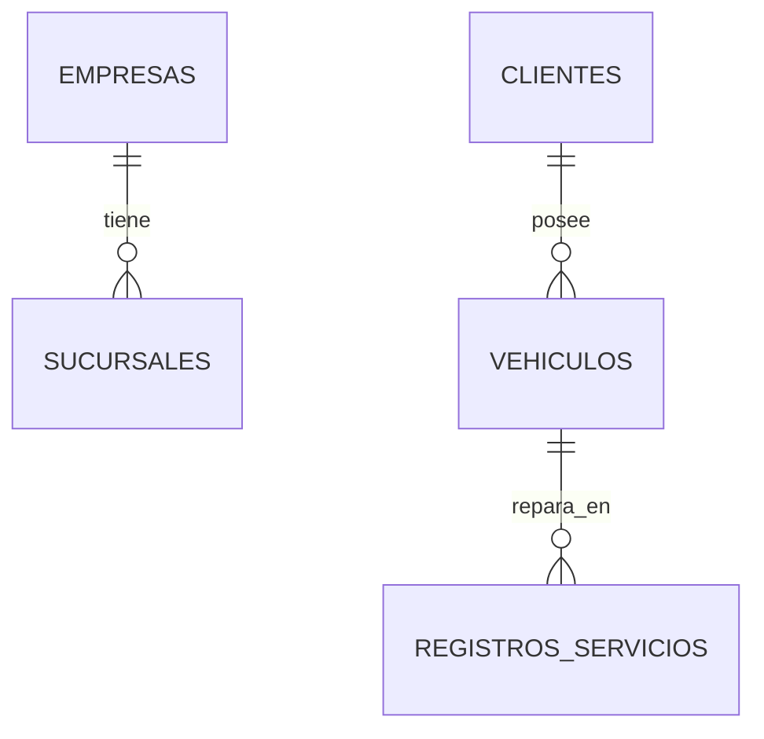

# Entidades Principales y Lógica de Base de Datos

Base de datos MySQL (`c110lizzosoftVehiculosTest`). Arquitectura **multitenant**: tablas operativas con `empresa_id` y `sucursal_id`.

## Modelo multi-tenant

Todo registro insertado, editado o consultado debe vincularse al `empresa_id` / `sucursal_id` de la sesión activa.

| Variable de sesión | Uso |
|--------------------|-----|
| `$_SESSION['empresa_id']` | Aislamiento entre empresas |
| `$_SESSION['sucursal_id']` | Sede operativa |
| `$_SESSION['IDUsuario']`, `$_SESSION['IDRol']` | Usuario y rol |
| `$_SESSION['cliente_config']` | Array de `clientes_config/{empresa}/config.php` |

## Tablas core

- **empresas:** `id`, `nombre`, `razon_social`, `cuit`, `estado`, ruta en `clientes_config/`
- **sucursales:** `id`, `empresa_id`, `IDRubro` (1=Motos, 2=Autos, 3=Camiones, 4=Trafics), `nombre`
- **usuarios:** `IDUsuario`, `nombreUsuario`, `contraseñaUsuario` (MD5), `sucursal_id`, `empresa_id`, `IDRol`
- **clientes:** `IDCliente`, `numeroDocumentoCliente`, `empresa_id` — único `unq_doc_cliente_empresa`
- **vehiculos:** `IDVehiculo`, `patente`, `IDCliente`, `empresa_id`, tipos/marcas/modelos
- **registrosservicios:** `IDRegistroServicio`, `IDVehiculo`, `empresa_id`, `sucursal_id`, `EstadoRegistroServicio`, `numeroOrdenTrabajo`

## Relaciones operativas

1. [[GestionClientes]] → [[GestionVehiculos]] → [[Flujo Reclamos]] → [[Flujo Orden de Servicio]] → [[GestionStock]]

## Lógica interna (triggers) — no replicar en PHP

1. **`tr_actualizar_estado_orden`:** actualiza estado en `registrosservicios` según `detalleregistro`.
2. **`reservar_stock_servicio`:** al insertar en `detalle_servicios`, registra movimiento de stock.
3. **`actualizar_stock_after_insert`:** actualiza `stock_sucursal` tras `movimientos_stock`.
4. **`tr_log_cambio_usuario`:** log en `logs_accesos` si cambia contraseña.

## Procedimientos almacenados

Usar `CALL` en lugar de SQL complejo en PHP:

- `sp_carga_trabajo_personal`
- `sp_reporte_accesos`
- `sp_reporte_ingresos_servicios`
- `sp_reporte_personal_productividad`
- `sp_reporte_servicios_estado`
- `sp_crear_personal_usuario`

## Estado

`Implementado` en BD; validar scripts PHP contra triggers y SP.
